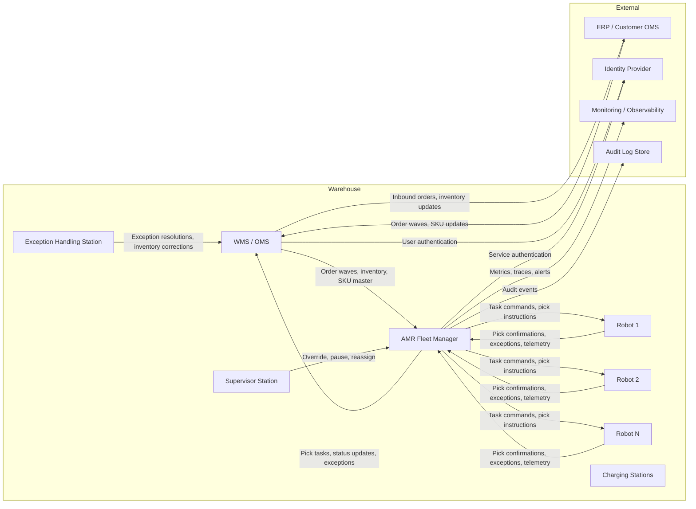

# Integration Architecture: WMS + AMR Fleet in a 3PL Warehouse

This document describes the integration architecture for a mid-market 3PL e-commerce warehouse deploying collaborative AMRs alongside an existing WMS. The PRD is in `prd-warehouse-amr-deployment.md`.

## High-level data flow

## Components

### 1. WMS / OMS

The existing warehouse management system. It is the system of record for:
- Inventory
- Orders and order waves
- SKU master data (dimensions, weight, images, storage rules)
- Locations and slotting
- Receiving, putaway, and shipping transactions

The WMS does not directly control robots. It releases work to the AMR fleet manager and receives confirmations back.

### 2. AMR Fleet Manager

The vendor-provided or internally built middleware that:
- Receives order waves from the WMS.
- Translates waves into robot tasks (pick tours, replenishment, putaway).
- Allocates tasks to robots based on location, battery, priority, and traffic.
- Sends pick instructions to robot screens.
- Receives pick confirmations, exceptions, and telemetry from robots.
- Updates the WMS with completed picks and exceptions.
- Exposes a supervisor dashboard for monitoring and override.

The fleet manager is the control plane. It must be highly available during operating hours.

### 3. Robots

Collaborative AMRs (person-to-goods) with:
- On-board computer for navigation, task execution, and screen display.
- Sensors for SLAM navigation, obstacle avoidance, and safety.
- Battery and charging logic.
- API or local message bus for communication with the fleet manager.

Robots are stateful during a task but can be reassigned if they fail or are removed.

### 4. Supervisor Station

A tablet or web dashboard that gives supervisors:
- Real-time fleet status.
- Picker and robot performance metrics.
- Alerting and exception queues.
- Manual override controls (pause, resume, reassign, send-to-charge).

### 5. Exception Handling Station

A workstation or tablet for resolving exceptions reported by pickers or robots:
- Missing SKU
- Wrong SKU
- Damaged item
- Location mismatch
- WMS sync discrepancy

Resolutions are written back to the WMS and may trigger inventory adjustments or re-picks.

### 6. Charging Stations

Physical infrastructure where robots charge autonomously or are swapped. The fleet manager tracks battery levels and schedules charging windows outside of peak demand.

## Interfaces and protocols

| Interface | From | To | Pattern | Payload |
|---|---|---|---|---|
| Order wave release | WMS | Fleet Manager | HTTPS POST or SFTP file | Order wave ID, order lines, priorities, customer SLAs |
| Inventory sync | WMS | Fleet Manager | HTTPS GET or scheduled file | SKU, location, quantity, dimensions, images |
| Pick confirmation | Fleet Manager | WMS | HTTPS POST or message queue | Order line, picked quantity, robot ID, picker ID, timestamp |
| Exception event | Fleet Manager / Robot | WMS | Message queue | Exception type, location, SKU, order line, status |
| Robot command | Fleet Manager | Robot | WebSocket or MQTT over local Wi-Fi | Task ID, destination, pick instructions |
| Robot telemetry | Robot | Fleet Manager | WebSocket or MQTT | Position, battery, status, errors, sensor data |
| Supervisor override | Supervisor Station | Fleet Manager | HTTPS POST / WebSocket | Pause, resume, reassign, send-to-charge |
| Monitoring | Fleet Manager | Observability | HTTPS POST or OTel | Metrics, traces, logs |
| Audit log | Fleet Manager | Log Store | Append-only stream | All pick and exception events |

## Failure handling

### WMS to Fleet Manager sync failure
- **Detection:** Heartbeat or message queue age threshold exceeded.
- **Response:** Fleet manager queues robot tasks locally. Supervisor alerted. If outage exceeds 5 minutes, robots complete current tasks and return to charging stations.
- **Recovery:** On WMS restore, replay events in order; reconcile inventory and pick confirmations.
- **Fallback:** Manual RF or paper picking for new waves until integration is restored.

### Robot loses Wi-Fi or fails mid-task
- **Detection:** Robot heartbeat timeout, telemetry loss, or task timeout.
- **Response:** Fleet manager reassigns task to another robot. Failed robot navigates to a safe zone or is retrieved by maintenance.
- **Recovery:** Robot rejoins fleet after health check. Task state is restored from fleet manager.

### Robot battery depletion during task
- **Detection:** Battery threshold alert (<20%).
- **Response:** Robot completes current pick if safe, then returns to charging station. Task is reassigned.
- **Recovery:** Resume task after charge or hand off to a fully charged robot.

### Exception backlog
- **Detection:** Exception queue age or count exceeds threshold.
- **Response:** Alert supervisor. Pause new wave release for affected zone until backlog is cleared.
- **Recovery:** Resolve exceptions, update WMS, release held orders.

### Security incident (unauthorized access to fleet manager)
- **Detection:** Authentication anomaly, rate limiting, or intrusion detection alert.
- **Response:** Revoke session tokens, force re-authentication, pause non-critical robot tasks.
- **Recovery:** Audit logs reviewed, access controls tightened, service resumed.

## Data model (simplified)

### Order Wave
- wave_id
- warehouse_id
- release_time
- priority
- customer_sla
- status (released, in_progress, completed, exception)

### Task
- task_id
- wave_id
- robot_id
- picker_id
- status (assigned, in_progress, completed, exception, cancelled)
- pick_sequence (list of locations/SKUs/quantities)
- start_time
- end_time

### Pick Confirmation
- confirmation_id
- task_id
- order_line_id
- sku
- location
- picked_quantity
- robot_id
- picker_id
- timestamp
- exception_code (optional)

### Robot State
- robot_id
- battery_percent
- status (idle, moving, picking, charging, maintenance, offline)
- current_location
- current_task_id
- last_heartbeat

### Exception
- exception_id
- task_id
- order_line_id
- type (missing, wrong, damaged, location_mismatch, system_error)
- status (open, resolved, escalated)
- resolved_by
- resolution_notes

## Network and security

### Network
- Warehouse Wi-Fi segmented into:
  - WMS VLAN (enterprise systems)
  - AMR VLAN (robot fleet and fleet manager)
  - Supervisor VLAN (tablets and dashboards)
  - Guest VLAN (isolated from operational systems)
- Firewall rules allow only required ports and IPs between VLANs.
- Local DNS and NTP for robot fleet coordination.
- VPN or MPLS for cloud-hosted fleet manager or vendor support access.

### Authentication and authorization
- WMS API access via OAuth 2.0 client credentials or mutual TLS.
- Robot authentication via device certificates.
- Supervisor dashboard access via SSO and role-based access control.
- Audit logging for all administrative actions.

### Data protection
- SKU and order data encrypted at rest and in transit.
- Personal data (picker IDs) pseudonymized in analytics exports.
- Retention policy for audit logs aligned with customer contract requirements.

## Observability

| Layer | Metric | Alert threshold |
|---|---|---|
| Business | Orders shipped per hour | Drop >15% vs. baseline |
| Business | Order error rate | >0.5% |
| Integration | WMS sync latency | >5 minutes |
| Fleet | Robot fleet uptime | <99.5% |
| Fleet | Robots waiting for assignment | >20% of fleet for >10 minutes |
| Picker | Picks per labor hour | Drop >20% vs. baseline |
| Robot | Battery level | <15% while on task |
| Robot | Task completion time | >2x expected for 3 consecutive tasks |

## Open questions

1. Will the fleet manager be hosted on-premise, in the cloud, or hybrid? This affects latency and failover design.
2. Does the vendor support MQTT, WebSocket, or a proprietary protocol for robot-to-fleet communication?
3. What is the maximum number of robots the fleet manager can support in a single facility? How does it scale?
4. How is the WMS integration tested before go-live? Is there a vendor-provided sandbox?
5. What is the disaster recovery plan for the fleet manager? Can the warehouse operate manually for a full shift if it fails?

## References

- PRD: `prd-warehouse-amr-deployment.md`
- Vendor matrix: `vendor-matrix.md`
- Case study: `case-study-walmart-symbotic.md`
